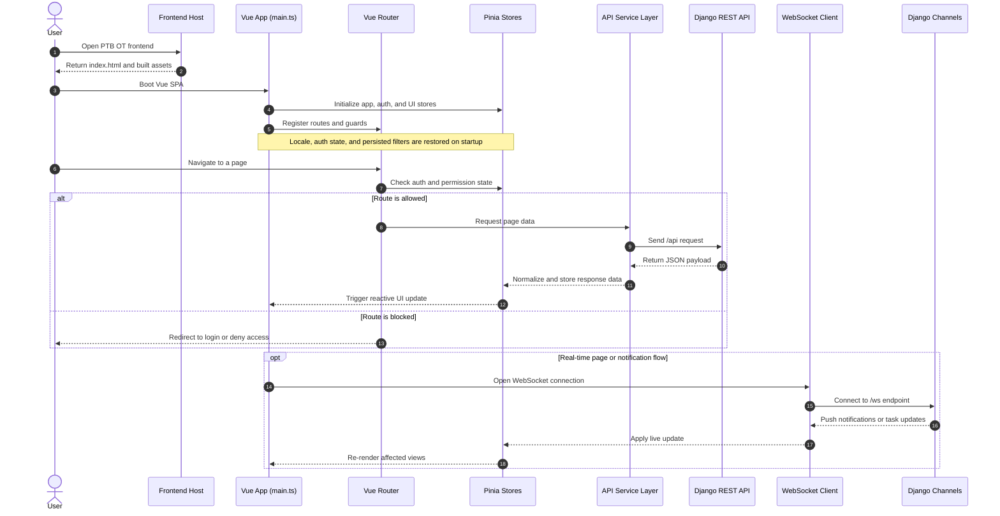

# PTB Overtime Application - Frontend

> A modern Vue 3 Single-Page Application built with Vite, TypeScript, and Tailwind CSS. This is the user-facing half of the PTB Overtime Management system, where employees submit overtime, managers approve requests, and teams collaborate in real time.

[](https://vuejs.org/)
[](https://www.typescriptlang.org/)
[](https://vite.dev/)
[](https://tailwindcss.com/)
[](https://pinia.vuejs.org/)

---

## Table of Contents

- [PTB Overtime Application - Frontend](#ptb-overtime-application---frontend)
  - [Table of Contents](#table-of-contents)
  - [Role \& Design Philosophy](#role--design-philosophy)
  - [System Architecture](#system-architecture)
  - [Tech Stack](#tech-stack)
  - [Prerequisites](#prerequisites)
  - [Quick Start](#quick-start)
  - [Available Scripts](#available-scripts)
  - [Environment Variables](#environment-variables)
  - [Project Structure](#project-structure)
    - [Frontend Folder Guide](#frontend-folder-guide)
  - [Routing \& Page Inventory](#routing--page-inventory)
    - [Public Routes](#public-routes)
    - [Authenticated Routes](#authenticated-routes)
    - [Admin Routes](#admin-routes)
    - [Navigation Guards](#navigation-guards)
  - [Filtering \& Analytics UX](#filtering--analytics-ux)
    - [Shared FilterDropdown](#shared-filterdropdown)
    - [Overtime Analytics Pages](#overtime-analytics-pages)
    - [Other Filtered Pages](#other-filtered-pages)
  - [State Management (Pinia)](#state-management-pinia)
  - [Internationalization (i18n)](#internationalization-i18n)
  - [WebSocket Integration](#websocket-integration)
  - [Code Quality](#code-quality)
    - [Linter \& Formatter: Biome](#linter--formatter-biome)
    - [Type Checking](#type-checking)
  - [Docker Deployment](#docker-deployment)
    - [Production](#production)
    - [Health Check](#health-check)
  - [Build \& Bundle Optimization](#build--bundle-optimization)

---

## Role & Design Philosophy

This frontend serves as the **complete user experience** for the PTB Overtime system. It's designed around these principles:

- **TypeScript-first** — full type safety across components, stores, services, and API calls
- **Composition API** — all components use Vue 3 `<script setup>` with composable extraction for reusable logic
- **Utility-first CSS** — Tailwind CSS 4 for rapid, consistent styling with no CSS bloat
- **Reactive stores** — Pinia for centralized, predictable state management
- **Real-time** — WebSocket integration for notifications, Kanban collaboration, and live task editing
- **i18n-ready** — full localization support for English, Chinese, and Bahasa Indonesia
- **Chunked builds** — manual vendor splitting for optimal loading performance

---

## System Architecture

This sequence diagram shows how the frontend boots, loads data, and stays in sync with backend updates.



---

## Tech Stack

| Category | Technology | Purpose |
| --- | --- | --- |
| **Framework** | Vue 3.5 | Reactive UI components |
| **Language** | TypeScript 5.9 | Type safety |
| **Build Tool** | Vite 7.3 | HMR dev server + production bundler |
| **Routing** | Vue Router 5 | SPA navigation with guards |
| **State** | Pinia 3 | Centralized store management |
| **HTTP** | Axios | API communication with interceptors |
| **Styling** | Tailwind CSS 4 | Utility-first CSS framework |
| **Charts** | ApexCharts + vue3-apexcharts | Data visualization |
| **Calendar** | FullCalendar 7 (beta) | Interactive calendar views |
| **Icons** | Lucide Vue Next | Icon library |
| **Drag & Drop** | @vue-dnd-kit/core + vuedraggable | Kanban boards, reordering |
| **i18n** | vue-i18n 11 | Multi-language support |
| **Excel** | @e965/xlsx | Client-side spreadsheet handling |
| **File Upload** | Dropzone 6 | Drag-and-drop file uploads |
| **Carousel** | Swiper 12 | Touch-friendly slideshows |
| **Date Picker** | Flatpickr | Date/time selection |
| **Linter** | Biome 2.4 | Linting + formatting (single tool) |

---

## Prerequisites

| Requirement | Version | Notes |
| --- | --- | --- |
| Node.js | 22+ | LTS recommended |
| pnpm | 9+ | Install via `corepack enable && corepack prepare pnpm@latest --activate` |
| Git | Any | Version control |
| Backend API | Running | See [backend/README.md](../backend/README.md) |

---

## Quick Start

```bash
# 1. Navigate to the frontend directory
cd frontend

# 2. Install dependencies
pnpm install

# 3. Start the development server
pnpm dev
```

The dev server starts at **`http://localhost:3334`** with Hot Module Replacement (HMR).

> The Vite dev server automatically proxies `/api` requests to the backend at `http://172.18.220.56:8008`.

---

## Available Scripts

| Script | Command | Description |
| --- | --- | --- |
| `pnpm dev` | `vite` | Start Vite HMR dev server on port 3334 |
| `pnpm build` | `vue-tsc --build` + `vite build` | Type-check and produce production bundle |
| `pnpm preview` | `vite preview` | Preview the production build locally |
| `pnpm build-only` | `vite build` | Build without type-checking |
| `pnpm type-check` | `vue-tsc --build` | Run TypeScript type-checking |
| `pnpm lint` | `biome check --write .` | Lint and auto-fix all files |
| `pnpm format` | `biome format --write src` | Format all source files |

---

## Environment Variables

Environment variables are prefixed with `VITE_` and accessed via `import.meta.env`:

| Variable | Description | Default |
| --- | --- | --- |
| `VITE_API_BASE_URL` | Backend API base URL (recommended via reverse proxy) | `/api` |
| `VITE_API_TIMEOUT` | API request timeout (ms) | `30000` |
| `VITE_WS_URL` | WebSocket base URL | Derived from API URL |

Create environment files as needed:

```bash
# Development (loaded by default with `pnpm dev`)
cp .env.example .env.dev

# Production (loaded during `pnpm build`)
cp .env.example .env.prod
```

---

## Project Structure

```text
frontend/
├── index.html                      # SPA entry point
├── package.json                    # Dependencies & scripts
├── vite.config.ts                  # Vite build configuration
├── tsconfig.json                   # TypeScript root config
├── tsconfig.app.json               # App-specific TS config
├── tsconfig.node.json              # Node-specific TS config
├── postcss.config.js               # PostCSS / Tailwind pipeline
├── biome.json                      # Biome linter + formatter config
├── env.d.ts                        # Vite env type declarations
│
├── Dockerfile.prod                 # Production Docker image (nginx)
├── docker-compose.prod.yml         # Production Docker Compose
├── docker-compose.staging.yml      # Staging Docker Compose
│
├── nginx/
│   ├── nginx.conf                  # Dev Nginx (proxy to Vite)
│   └── nginx.prod.conf            # Production Nginx (static + API proxy)
│
├── public/                         # Static assets (copied as-is)
│
└── src/
    ├── main.ts                     # App bootstrap (Vue, Pinia, Router, i18n)
    ├── App.vue                     # Root component
    │
    ├── assets/                     # Processed assets (images, fonts, CSS)
    │
    ├── components/                 # Reusable UI components
    │   ├── layout/                 #   App shell, sidebar, header
    │   ├── ui/                     #   Shared UI primitives like FilterDropdown
    │   ├── overtime/               #   OT-specific components
    │   ├── kanban/                 #   Kanban-specific UI
    │   └── ...                     #   Modals, forms, tables, charts, admin tabs
    │
    ├── composables/                # Composition API logic extraction
    │   ├── kanban/                  #   Kanban board composables (5 files)
    │   ├── calendar/               #   Calendar logic
    │   ├── useConfirmDialog.ts     #   Confirmation dialog
    │   ├── useDebounce.ts          #   Debounce utility
    │   ├── usePagePermission.ts    #   Route-level permission checks
    │   ├── useToast.ts             #   Toast notifications
    │   ├── useSidebar.ts           #   Sidebar state
    │   └── useAsyncComponent.ts    #   Async component loading
    │
    ├── i18n/                       # Internationalization
    │   ├── index.ts                #   vue-i18n setup
    │   └── locales/                #   Translation files (en, zh, id)
    │
    ├── icons/                      # Custom SVG icon components
    │
    ├── router/
    │   └── index.ts                # Route definitions + navigation guards
    │
    ├── services/                   # API & WebSocket communication
    │   ├── api/                    #   Domain-specific API modules
    │   ├── api.ts                  #   Shared Axios client entry
    │   └── websocket.ts            #   WebSocket client classes
    │
    ├── stores/                     # Pinia state stores
    │   ├── auth.ts                 #   Authentication & user role state
    │   ├── overtime.ts             #   Overtime request state
    │   ├── employee.ts             #   Employee data
    │   ├── project.ts              #   Project data
    │   ├── department.ts           #   Department data
    │   ├── calendar.ts             #   Calendar events
    │   ├── notification.ts         #   Notification state
    │   ├── reminder.ts             #   Event reminders
    │   ├── config.ts               #   System configuration
    │   ├── ui.ts                   #   UI state (sidebar, theme)
    │   └── index.ts                #   Store barrel export
    │
    ├── types/                      # TypeScript type definitions
    │
    ├── utils/                      # Utility functions
    │
    └── views/                      # Page-level components (route targets)
        ├── Auth/                   #   Login page
        ├── Errors/                 #   404 page
        ├── OvertimeForm.vue        #   OT submission form
        ├── OvertimeHistory.vue     #   OT request history
        ├── OvertimeSummary.vue     #   OT summary dashboard
        ├── OvertimeCalendar.vue    #   OT calendar view
        ├── KanbanBoard.vue         #   Task Kanban board
        ├── Documents.vue           #   Document library
        ├── PersonalNotesBoard.vue  #   Personal notes
        ├── PtbCalendar.vue         #   PTB calendar
        ├── Notifications.vue       #   Notification center
        ├── PurchasingList.vue      #   Purchase request list
        ├── PurchasingRequest.vue   #   Purchase request form
        ├── Assets.vue              #   Asset management
        ├── AdminDepartment.vue     #   Department admin
        ├── AdminEmployee.vue       #   Employee admin
        ├── AdminProject.vue        #   Project admin
        ├── AdminOvertimeRegulations.vue  # OT regulation admin
        ├── SuperAdminAccessControl.vue   # Role & permission management
        ├── UserProfile.vue         #   User profile & preferences
        ├── UserReport.vue          #   Report generation
        ├── ReleaseNotes.vue        #   App release notes
        ├── AboutPage.vue           #   About page
        ├── EmployeeOvertimeDetail.vue    # Employee OT detail
        └── ProjectOvertimeDetail.vue     # Project OT detail
```

### Frontend Folder Guide

- `src/components/` contains reusable UI building blocks. The `ui/` subfolder is where shared primitives such as `FilterDropdown.vue` live, while feature folders such as `kanban/`, `overtime/`, and admin-related folders hold domain-specific presentation pieces.
- `src/composables/` contains reusable Composition API logic. Domain folders such as `kanban/` keep board behavior isolated, while shared hooks handle debounce, permissions, async component loading, and UI state.
- `src/services/api/` is the typed frontend contract to the backend. Feature modules such as overtime, employee, project, task, and report APIs are split into their own files rather than being kept in one large client.
- `src/stores/` holds Pinia stores for auth, overtime, employee/project data, notifications, and UI state. The UI store also persists date filter choices reused across overtime pages.
- `src/views/` contains route-level pages. Some complex admin screens render smaller tab components from `src/components/` instead of putting every screen directly under `views/`.
- `public/` stores static assets copied through Vite as-is, while `src/assets/` is for processed app assets included in the bundle.

---

## Routing & Page Inventory

### Public Routes

| Path | Page | Description |
| --- | --- | --- |
| `/login` | Login | External authentication |

### Authenticated Routes

| Path | Page | Access |
| --- | --- | --- |
| `/ot/form` | Overtime Form | All users |
| `/ot/history` | Overtime History | All users |
| `/ot/summary` | Overtime Summary | Admin+ |
| `/ot/employee/:id/:slug` | Employee OT Detail | All users |
| `/ot/project/:id/:slug` | Project OT Detail | All users |
| `/calendar` | Overtime Calendar | All users |
| `/ptb-calendar` | PTB Calendar | All users |
| `/kanban` | Kanban Board | All users |
| `/documents` | Documents | All users |
| `/notes` | Personal Notes | All users |
| `/notifications` | Notification Center | All users |
| `/purchasing/list` | Purchase Requests | All users |
| `/purchasing/request` | New Purchase Request | All users |
| `/asset-management` | Asset Management | All users |
| `/profile` | User Profile | All users |
| `/about` | About Page | All users |
| `/release-notes` | Release Notes | All users |
| `/report` | User Reports | All users |

### Admin Routes

| Path | Page | Access |
| --- | --- | --- |
| `/admin/departments` | Department Management | Admin+ |
| `/admin/employees` | Employee Management | Admin+ |
| `/admin/projects` | Project Management | Admin+ |
| `/admin/ot-regulations` | OT Regulation Management | Admin+ |
| `/super-admin/access-control` | Access Control | Superadmin+ |

### Navigation Guards

- **Authentication**: redirects unauthenticated users to `/login`
- **External auth**: redirects to SSO flow when external token is available
- **Role-based**: enforces `requiresSuperAdmin` and resource-based `hasPermission()` checks
- **Page title**: dynamically set via `afterEach` hook
- **Activity logging**: fire-and-forget page view tracking with 30-second deduplication

---

## Filtering & Analytics UX

### Shared FilterDropdown

The app now standardizes multi-select filtering around `src/components/ui/FilterDropdown.vue`.

- `FilterDropdown` accepts `string[]` values, supports built-in search, clear, disabled state, and outside-click closing.
- It is used where the UI benefits from searchable or reusable multi-select behavior instead of one-off native selects.
- Current rollout targets include Overtime History, Assets, Kanban filter panels, Documents, Activity Logs, User Reports, and the overtime detail comparison pages.

### Overtime Analytics Pages

- `OvertimeSummary.vue` supports multi-month filtering using the overtime period model of the 26th through the 25th, and it loads the available year list from the backend so users only see years that actually contain overtime data.
- `EmployeeOvertimeDetail.vue` supports selecting multiple employees at once. The trend chart renders one series per selected employee, while summary cards, type breakdowns, project rankings, and request history aggregate across the selected set.
- `ProjectOvertimeDetail.vue` supports selecting multiple projects at once. The trend chart renders one series per selected project, while contributor and employee breakdowns aggregate from the filtered request set.

### Other Filtered Pages

- `OvertimeHistory.vue` now uses shared multi-select filters for status, employee, project, and department.
- `Assets.vue` supports multi-select department and status filtering.
- `KanbanFilterPanel.vue` replaces the custom `MultipleSelect` dependency with the shared dropdown pattern for department, employee, project, status, priority, label, and group.
- `Documents.vue` uses the shared dropdown for categories, tags, and source type so the filtering model is consistent with the rest of the app.
- Admin-facing activity logs and user reports also use the same multi-select filter pattern, which means the UX is consistent across operational and end-user pages.

---

## State Management (Pinia)

| Store | Responsibility |
| --- | --- |
| `auth` | User authentication, JWT tokens, role checks (`isSuperAdmin`, `isDeveloper`, `isPtbAdmin`), permissions |
| `overtime` | Overtime requests, form state, submission logic |
| `employee` | Employee data fetching and caching |
| `project` | Project data fetching and caching |
| `department` | Department data |
| `calendar` | Calendar events and filters |
| `notification` | Notification list, unread counts |
| `reminder` | Event reminder scheduling and state |
| `config` | System configuration from backend |
| `ui` | Sidebar state, theme preferences |

---

## Internationalization (i18n)

The app supports three languages using `vue-i18n`:

| Locale | Language | Flag |
| --- | --- | --- |
| `en` | English | 🇺🇸 |
| `zh` | Chinese (Simplified) | 🇨🇳 |
| `id` | Bahasa Indonesia | 🇮🇩 |

- **Persisted** in `localStorage` (key: `app_locale`)
- **Fallback**: English (`en`)
- **Legacy mode**: disabled — uses Composition API (`useI18n()`)
- Translation files are located in `src/i18n/locales/`

---

## WebSocket Integration

Three WebSocket channels connect to the backend for real-time features:

| Class | Endpoint | Purpose |
| --- | --- | --- |
| `PermissionWebSocket` | `ws/notifications/` | Live notifications, unread counts, permission updates |
| `BoardWebSocket` | `ws/board/` | Kanban board presence, task CRUD broadcasts |
| `TaskDetailWebSocket` | `ws/board/task/<id>/` | Per-task comments, typing indicators, editor tracking |

WebSocket clients are defined in `src/services/websocket.ts` with automatic reconnection and token-based authentication.

---

## Code Quality

### Linter & Formatter: Biome

The project uses [Biome](https://biomejs.dev/) as its unified linter and formatter:

```bash
# Lint and auto-fix
pnpm lint

# Format source files
pnpm format
```

**Key configuration** (`biome.json`):

- Indent: 2 spaces
- Line width: 100 characters
- Quotes: single
- Semicolons: none (ASI)
- Line endings: LF
- Vue-specific: `noUnusedImports` and `noUnusedVariables` disabled for `.vue` files

### Type Checking

```bash
pnpm type-check    # vue-tsc --build
```

Enforced during `pnpm build` — the build will fail on type errors.

---

## Docker Deployment

### Production

```bash
docker-compose -f docker-compose.prod.yml up -d
```

- **Build stage**: Node 20 Alpine, `pnpm install --frozen-lockfile`, `pnpm run build`
- **Runtime stage**: `nginx:1.25-alpine` serving static files on port **3333**
- **Nginx features**:
  - Frontend access URL: `http://172.18.220.56:3333`
  - Gzip compression (text, JS, CSS, JSON, SVG, WASM)
  - Static asset caching (1 year, `immutable`)
  - API proxy to `http://172.18.220.56:8008/api/`
  - WebSocket proxy to `ws://172.18.220.56:8008/ws/` (24h timeout)
  - SPA fallback (`try_files $uri $uri/ /index.html`)
  - Security headers (X-Frame-Options, X-Content-Type-Options, XSS-Protection)
  - Health check endpoint at `/health`
- **Log rotation**: 20 MB x 5 files

### Health Check

```bash
wget -q --spider http://localhost:3333/health
```

---

## Build & Bundle Optimization

Vite is configured with manual chunk splitting for optimal caching:

| Chunk | Contains | Rationale |
| --- | --- | --- |
| `vendor-vue` | Vue, Vue Router, Pinia | Core framework (rarely changes) |
| `vendor-charts` | ApexCharts | Large library, loaded by chart pages |
| `vendor-calendar` | FullCalendar | Large library, loaded by calendar pages |
| `vendor-ui` | Flatpickr, Swiper, Dropzone, Axios | Mid-size UI utilities |
| `vendor-xlsx` | @e965/xlsx | Spreadsheet processing |

Chunk size warning limit is set to **600 KB**. Route-level code splitting via dynamic imports ensures pages are loaded on demand.
